# Angular Notes

## The Angular ViewChildren Decorator and QueryList in Detail

1. @ViewChild and @ViewChildren are local template query mechanism, they can only query component references/nstivr elements of their template and nothing more, this means @ViewChild query can not see inside the templates of child components or parents components, e.g. content projected elements
2. They are aviliable after ngAfterViewInit is called

## The Angular Content Projection in Detail

`<ng-content></ng-content>`

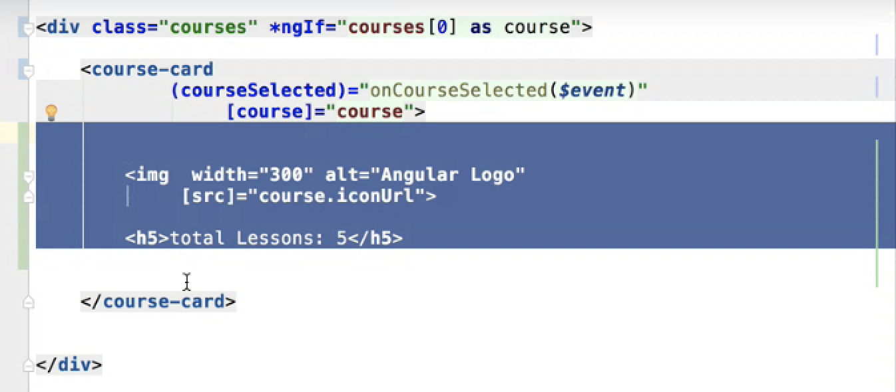
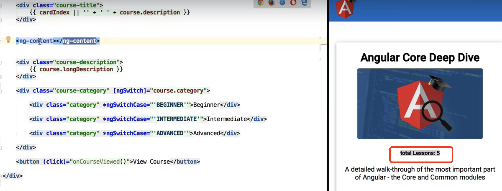

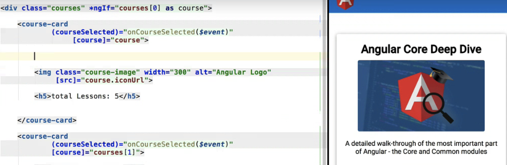
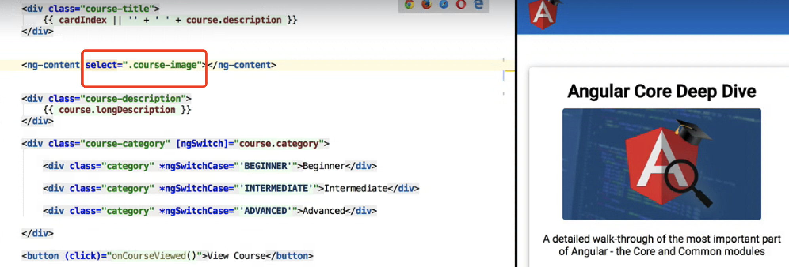

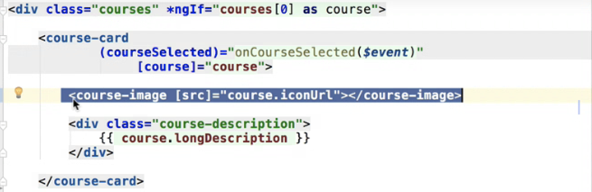
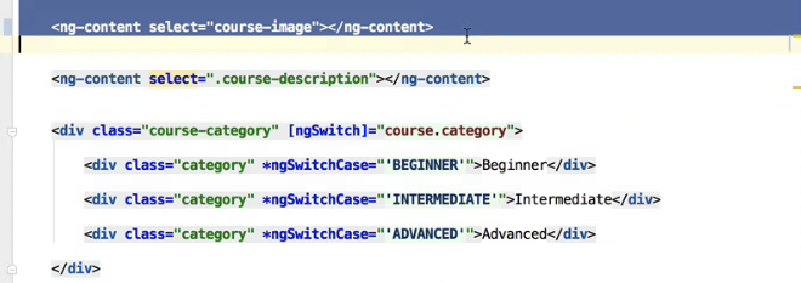

## Tha Angular ContentChild Decorator in Detail

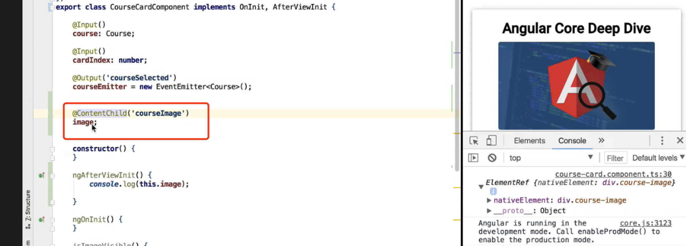
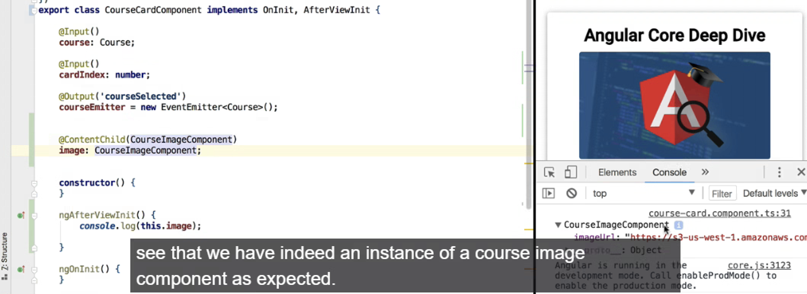

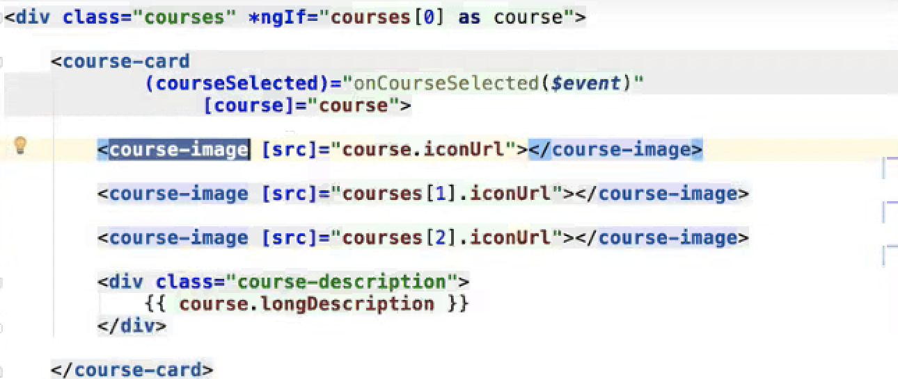
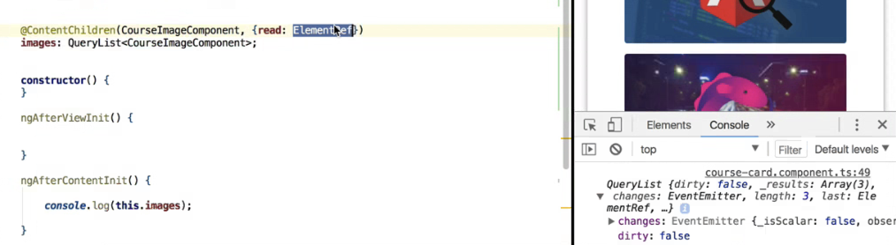

## Tha Angular ng-template

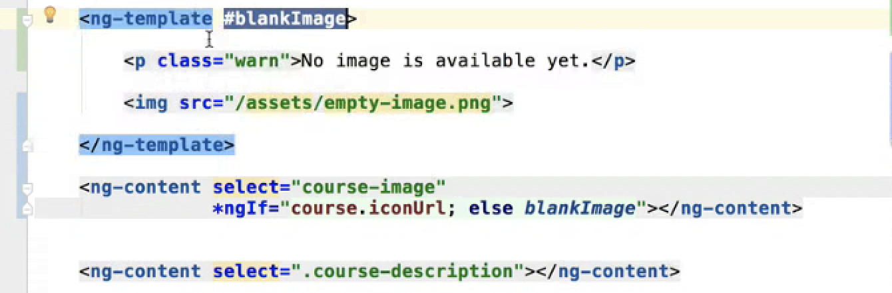
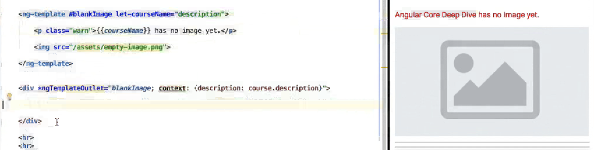

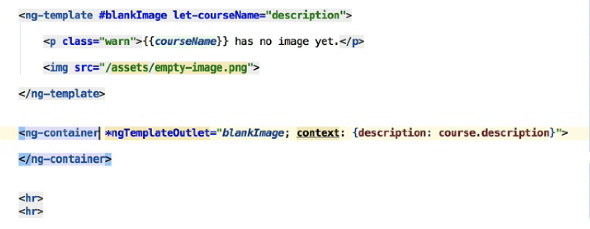
use `ng-container` instead, `ng-container` doesn't create extra elements

## Angular Templates as Component Inputs

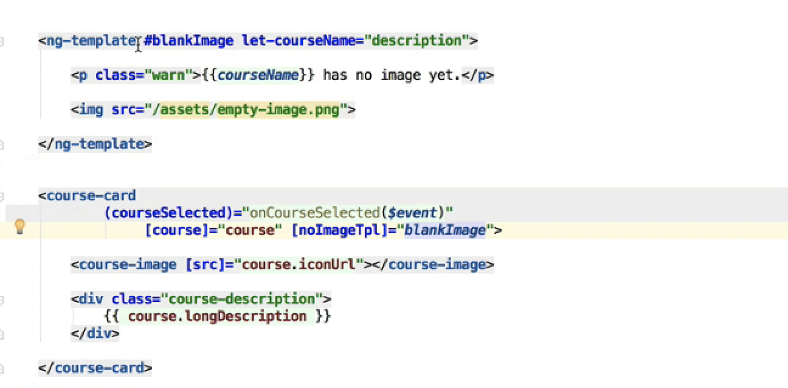
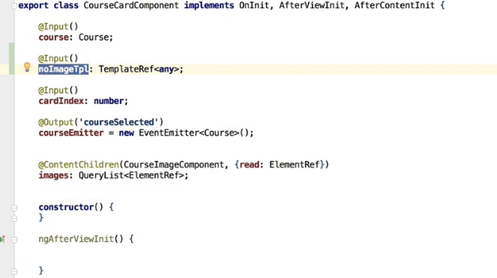
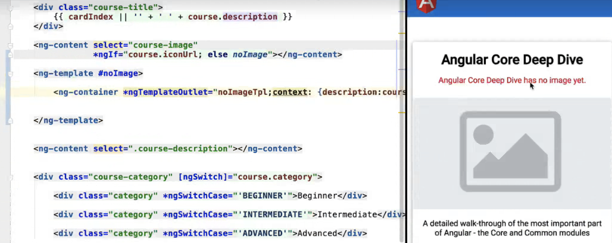

## Tha Angular Directive

- @HostBinding
- @HostListener
- Export as directive instance reference, in which way you can access public properties and methods

## Tha Angular Star Syntax

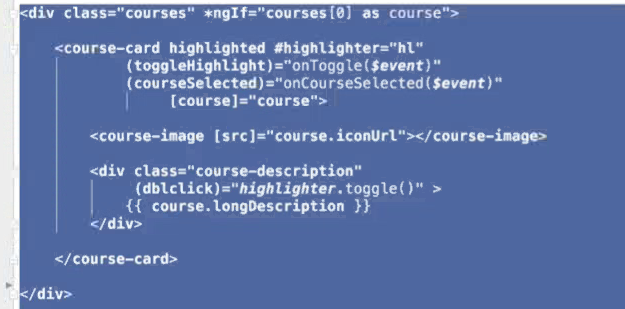

Under the hood
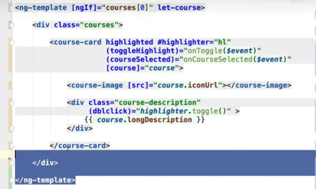

Write custom star syntax `ngxUnless`

## Tha Angular View Encapsulation Under the Hood

:host, ::ng-deep

with `::ng-deep` to remove `_ngcontent-c1` attributes

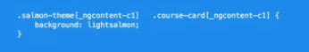

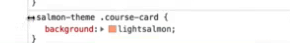

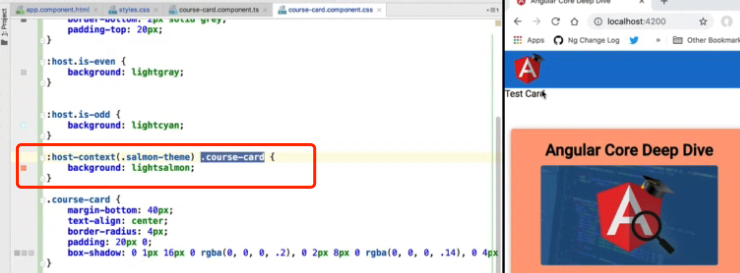

*Default vs Shadow DOM*

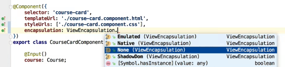

- ViewEncapsulation.Emulated(default)

- ViewEncapsulation.None

- ViewEncapsulation.ShadowDom

## Angular Injectable Services

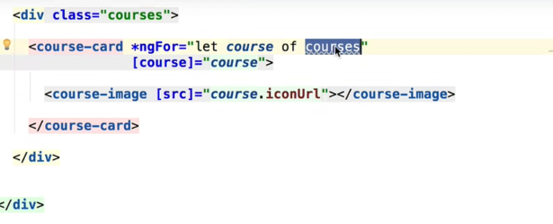
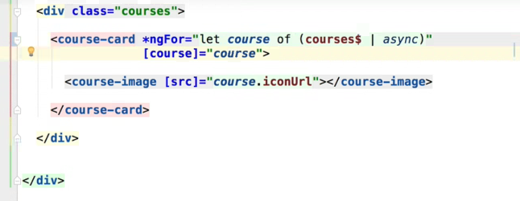
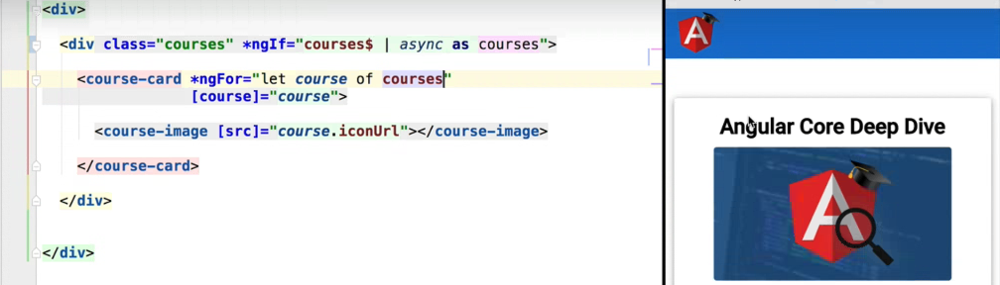

*Custom Service to fetch data*

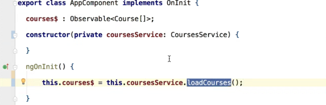
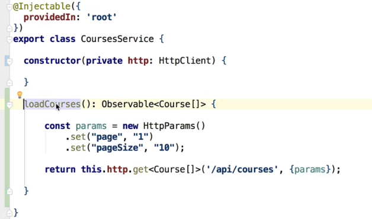